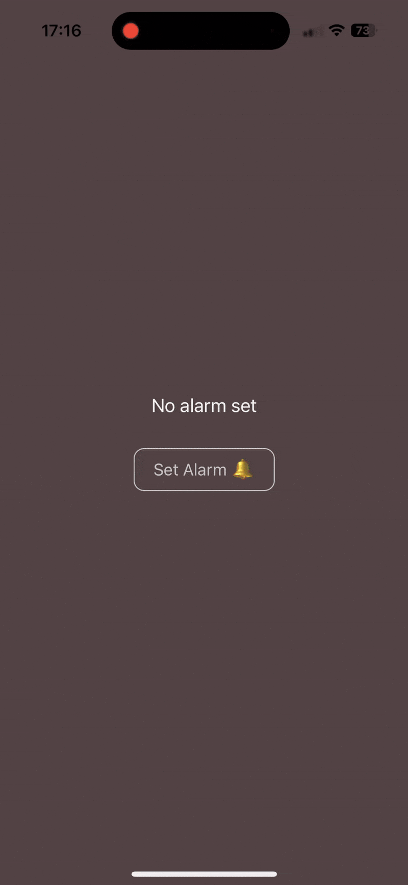
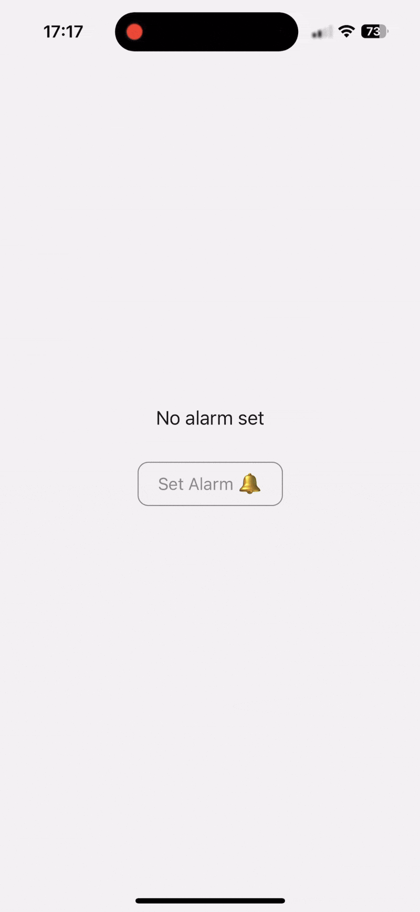
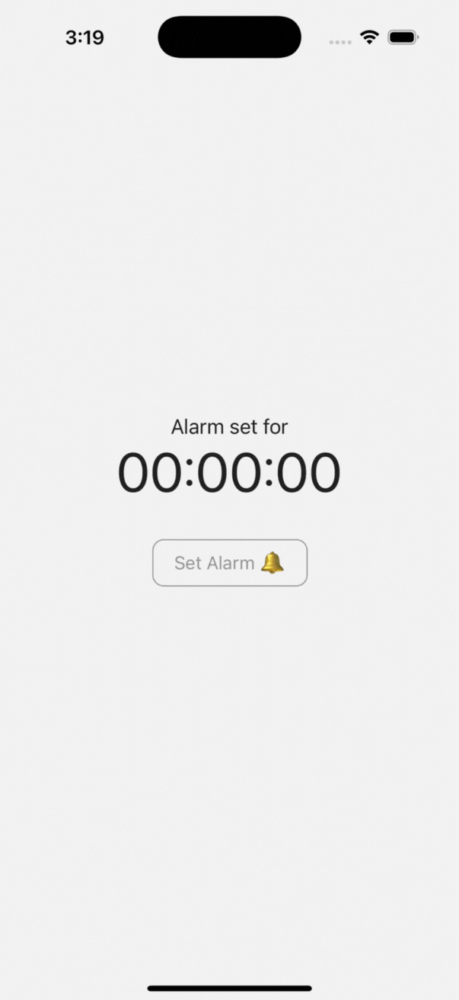
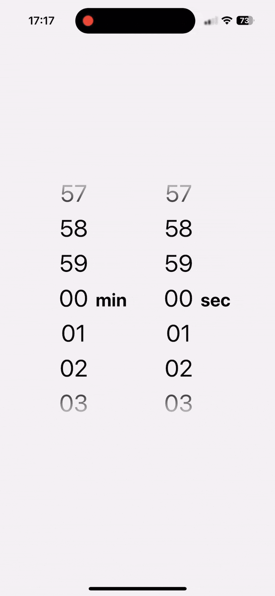

# React Native Timer Picker ⏰🕰️⏳

[]()

[](https://www.npmjs.com/package/react-native-timer-picker)
[](https://www.npmjs.com/package/react-native-timer-picker)

A simple, flexible, performant duration picker component for React Native apps 🔥

Great for timers, alarms and duration inputs.

Works with Expo and bare React Native apps ✅

Includes iOS-style haptic and audio feedback 🍏

-   [Demos 📱](#demos-)
-   [Peer Dependencies 👶](#peer-dependencies-)
    -   [Linear Gradient](#linear-gradient)
    -   [Haptic Feedback](#haptic-feedback)
    -   [Audio Feedback (Click Sound)](#audio-feedback-click-sound)
-   [Installation 🚀](#installation-)
-   [Examples 😎](#examples-)
    -   [Timer Picker Modal (Dark Mode) 🌚](#timer-picker-modal-dark-mode-)
    -   [Timer Picker Modal (Light Mode) 🌞](#timer-picker-modal-light-mode-)
    -   [Timer Picker with Customisation (Dark Mode) 🌒](#timer-picker-with-customisation-dark-mode-)
    -   [Timer Picker with Customisation (Light Mode) 🌔](#timer-picker-with-customisation-light-mode-)
-   [Props 💅](#props-)
    -   [TimerPicker ⏲️](#timerpicker-️)
        -   [Custom Styles 👗](#custom-styles-)
        -   [Custom FlatList](#custom-flatlist)
    -   [TimerPickerModal ⏰](#timerpickermodal-)
        -   [Custom Styles 👕](#custom-styles--1)
-   [Methods 🔄](#methods-)
    -   [TimerPicker](#timerpicker)
    -   [TimerPickerModal](#timerpickermodal)
-   [Contributing 🧑‍🤝‍🧑](#contributing-)
    -   [Dev Setup](#dev-setup)
    -   [GitHub Guidelines](#github-guidelines)
-   [Limitations ⚠](#limitations-)
-   [License 📝](#license-)

<br>

## Demos 📱

**Try it out for yourself on [Expo Snack](https://snack.expo.dev/@nuumi/react-native-timer-picker-demo)!** Make sure to run it on a mobile to see it working properly.

<p>
    
    
</p>
<p>
    
    
</p>

<br>

## Peer Dependencies 👶

This component will work in your React Native Project **_without any peer dependencies_**.

### Linear Gradient

If you want the numbers to fade in/out at the top and bottom of the picker, you will need to install either:

-   [expo-linear-gradient](https://www.npmjs.com/package/expo-linear-gradient) (if using Expo)
-   [react-native-linear-gradient](https://www.npmjs.com/package/react-native-linear-gradient) (if using in a bare React Native project)

**To enable the linear gradient, you need to supply the component as a prop to either TimerPickerModal or TimerPicker.**

### Haptic Feedback

This is currently only supported on Expo with the [expo-haptics](https://www.npmjs.com/package/expo-haptics) module:

`import * as Haptics from "expo-haptics";`

**To enable haptic feedback, you need to supply the imported `Haptics` namespace as a prop to either TimerPickerModal or TimerPicker.**

### Audio Feedback (Click Sound)

This is currently only supported on Expo with the [expo-av](https://www.npmjs.com/package/expo-av) module:

`import { Audio } from "expo-av";`

**To enable audio feedback, you need to supply the imported `Audio` class as a prop to either TimerPickerModal or TimerPicker.**

Please note that the default click sound uses a hosted mp3 file. To make the click sound work offline, you need to supply your own
sound asset through the `clickSoundAsset` prop. You can download the default click sound [here](https://drive.google.com/uc?export=download&id=10e1YkbNsRh-vGx1jmS1Nntz8xzkBp4_I).

<br>

## Installation 🚀

Supports React Native >= 0.59.0 and React >= 16.8.0.

Just run:

```bash
npm install react-native-timer-picker
```

or

```bash
yarn add react-native-timer-picker
```

<br>

## Examples 😎

### Timer Picker Modal (Dark Mode) 🌚

```jsx
import { TimerPickerModal } from "react-native-timer-picker";
import { LinearGradient } from "expo-linear-gradient"; // or `import LinearGradient from "react-native-linear-gradient"`
import { Audio } from "expo-av"; // for audio feedback (click sound as you scroll)
import * as Haptics from "expo-haptics"; // for haptic feedback

....
const [showPicker, setShowPicker] = useState(false);
const [alarmString, setAlarmString] = useState<
        string | null
    >(null);

const formatTime = ({
    hours,
    minutes,
    seconds,
}: {
    hours?: number;
    minutes?: number;
    seconds?: number;
}) => {
    const timeParts = [];

    if (hours !== undefined) {
        timeParts.push(hours.toString().padStart(2, "0"));
    }
    if (minutes !== undefined) {
        timeParts.push(minutes.toString().padStart(2, "0"));
    }
    if (seconds !== undefined) {
        timeParts.push(seconds.toString().padStart(2, "0"));
    }

    return timeParts.join(":");
};

return (
    <View style={{backgroundColor: "#514242", alignItems: "center", justifyContent: "center"}}>
        <Text style={{fontSize: 18, color: "#F1F1F1"}}>
            {alarmStringExample !== null
                ? "Alarm set for"
                : "No alarm set"}
        </Text>
        <TouchableOpacity
            activeOpacity={0.7}
            onPress={() => setShowPicker(true)}>
            <View style={{alignItems: "center"}}>
                {alarmString !== null ? (
                    <Text style={{color: "#F1F1F1", fontSize: 48}}>
                        {alarmString}
                    </Text>
                ) : null}
                <TouchableOpacity
                    activeOpacity={0.7}
                    onPress={() => setShowPicker(true)}>
                    <View style={{marginTop: 30}}>
                        <Text
                            style={{
                                paddingVertical: 10,
                                paddingHorizontal: 18,
                                borderWidth: 1,
                                borderRadius: 10,
                                fontSize: 16,
                                overflow: "hidden",
                                borderColor: "#C2C2C2",
                                color: "#C2C2C2"
                                }}>
                            Set Alarm 🔔
                        </Text>
                    </View>
                </TouchableOpacity>
            </View>
        </TouchableOpacity>
        <TimerPickerModal
            visible={showPicker}
            setIsVisible={setShowPicker}
            onConfirm={(pickedDuration) => {
                setAlarmString(formatTime(pickedDuration));
                setShowPicker(false);
            }}
            modalTitle="Set Alarm"
            onCancel={() => setShowPicker(false)}
            closeOnOverlayPress
            Audio={Audio}
            LinearGradient={LinearGradient}
            Haptics={Haptics}
            styles={{
                theme: "dark",
            }}
            modalProps={{
                overlayOpacity: 0.2,
            }}
        />
    </View>
)

```


### Timer Picker Modal (Light Mode) 🌞

```jsx
import { TimerPickerModal } from "react-native-timer-picker";
import { LinearGradient } from "expo-linear-gradient"; // or `import LinearGradient from "react-native-linear-gradient"`
import { Audio } from "expo-av"; // for audio feedback (click sound as you scroll)
import * as Haptics from "expo-haptics"; // for haptic feedback

....
const [showPicker, setShowPicker] = useState(false);
const [alarmString, setAlarmString] = useState<
        string | null
    >(null);

const formatTime = ({
    hours,
    minutes,
    seconds,
}: {
    hours?: number;
    minutes?: number;
    seconds?: number;
}) => {
    const timeParts = [];

    if (hours !== undefined) {
        timeParts.push(hours.toString().padStart(2, "0"));
    }
    if (minutes !== undefined) {
        timeParts.push(minutes.toString().padStart(2, "0"));
    }
    if (seconds !== undefined) {
        timeParts.push(seconds.toString().padStart(2, "0"));
    }

    return timeParts.join(":");
};

return (
    <View style={{backgroundColor: "#F1F1F1", alignItems: "center", justifyContent: "center"}}>
        <Text style={{fontSize: 18, color: "#202020"}}>
            {alarmStringExample !== null
                ? "Alarm set for"
                : "No alarm set"}
        </Text>
        <TouchableOpacity
            activeOpacity={0.7}
            onPress={() => setShowPicker(true)}>
            <View style={{alignItems: "center"}}>
                {alarmString !== null ? (
                    <Text style={{color: "#202020", fontSize: 48}}>
                        {alarmString}
                    </Text>
                ) : null}
                <TouchableOpacity
                    activeOpacity={0.7}
                    onPress={() => setShowPicker(true)}>
                    <View style={{marginTop: 30}}>
                        <Text
                            style={{paddingVertical: 10,
                            paddingHorizontal: 18,
                            borderWidth: 1,
                            borderRadius: 10,
                            fontSize: 16,
                            overflow: "hidden",
                            borderColor: "#8C8C8C",
                            color: "#8C8C8C"
                            }}>
                            Set Alarm 🔔
                        </Text>
                    </View>
                </TouchableOpacity>
            </View>
        </TouchableOpacity>
        <TimerPickerModal
            visible={showPicker}
            setIsVisible={setShowPicker}
            onConfirm={(pickedDuration) => {
                setAlarmString(formatTime(pickedDuration));
                setShowPicker(false);
            }}
            modalTitle="Set Alarm"
            onCancel={() => setShowPicker(false)}
            closeOnOverlayPress
            use12HourPicker
            Audio={Audio}
            // supply your own custom click sound asset
            clickSoundAsset={require("./assets/custom_click.mp3")}
            LinearGradient={LinearGradient}
            Haptics={Haptics}
            styles={{
                theme: "light",
            }}
        />
    </View>
)

```


### Timer Picker with Customisation (Dark Mode) 🌒

```jsx
import { TimerPicker } from "react-native-timer-picker";
import { LinearGradient } from "expo-linear-gradient"; // or `import LinearGradient from "react-native-linear-gradient"`
import { Audio } from "expo-av"; // for audio feedback (click sound as you scroll)
import * as Haptics from "expo-haptics"; // for haptic feedback

....
const [showPicker, setShowPicker] = useState(false);
const [alarmString, setAlarmString] = useState<
        string | null
    >(null);

return (
    <View style={{backgroundColor: "#202020", alignItems: "center", justifyContent: "center"}}>
        <TimerPicker
            padWithNItems={2}
            hourLabel=":"
            minuteLabel=":"
            secondLabel=""
            Audio={Audio}
            LinearGradient={LinearGradient}
            Haptics={Haptics}
            styles={{
                theme: "dark",
                backgroundColor: "#202020",
                pickerItem: {
                    fontSize: 34,
                },
                pickerLabel: {
                    fontSize: 32,
                    marginTop: 0,
                },
                pickerContainer: {
                    marginRight: 6,
                },
                pickerItemContainer: {
                    width: 100
                },
                pickerLabelContainer: {
                    right: -20,
                    top: 0,
                    bottom: 6,
                    width: 40,
                    alignItems: "center",
                },
            }}
        />
    </View>
)

```


### Timer Picker with Customisation (Light Mode) 🌔

```jsx
import { TimerPicker } from "react-native-timer-picker";
import { LinearGradient } from "expo-linear-gradient"; // or `import LinearGradient from "react-native-linear-gradient"`
import { Audio } from "expo-av"; // for audio feedback (click sound as you scroll)
import * as Haptics from "expo-haptics"; // for haptic feedback

....
const [showPicker, setShowPicker] = useState(false);
const [alarmString, setAlarmString] = useState<
        string | null
    >(null);

return (
    <View style={{backgroundColor: "#F1F1F1", alignItems: "center", justifyContent: "center"}}>
        <TimerPicker
            padWithNItems={3}
            hideHours
            minuteLabel="min"
            secondLabel="sec"
            Audio={Audio}
            LinearGradient={LinearGradient}
            Haptics={Haptics}
            styles={{
                theme: "light",
                pickerItem: {
                    fontSize: 34,
                },
                pickerLabel: {
                    fontSize: 26,
                    right: -20,
                },
                pickerLabelContainer: {
                    width: 60,
                },
                pickerItemContainer: {
                    width: 150,
                },
            }}
        />
    </View>
)

```


<br>

## Props 💅

### TimerPicker ⏲️

|               Prop               | Description                                                                     |                                                                                              Type                                                                                               | Default | Required |
| :------------------------------: | :------------------------------------------------------------------------------ | :---------------------------------------------------------------------------------------------------------------------------------------------------------------------------------------------: | :-----: | :------: |
|         onDurationChange         | Callback when the duration changes                                              |                                                            `(duration: { hours: number, minutes: number, seconds: number }) => void`                                                            |    -    |  false   |
|           initialValue           | Initial value for the picker                                                    |                                                                    `{ hours?: number, minutes?: number, seconds?: number }`                                                                     |    -    |  false   |
|            hideHours             | Hide the hours picker                                                           |                                                                                             Boolean                                                                                             |  false  |  false   |
|           hideMinutes            | Hide the minutes picker                                                         |                                                                                             Boolean                                                                                             |  false  |  false   |
|           hideSeconds            | Hide the seconds picker                                                         |                                                                                             Boolean                                                                                             |  false  |  false   |
|      hoursPickerIsDisabled       | Disable the hours picker picker                                                 |                                                                                             Boolean                                                                                             |  false  |  false   |
|     minutesPickerIsDisabled      | Disable the minutes picker picker                                               |                                                                                             Boolean                                                                                             |  false  |  false   |
|     secondsPickerIsDisabled      | Disable the seconds picker picker                                               |                                                                                             Boolean                                                                                             |  false  |  false   |
|            hourLimit             | Limit on the hours it is possible to select                                     |                                                                                `{ max?: Number, min?: Number }`                                                                                 |    -    |  false   |
|           minuteLimit            | Limit on the minutes it is possible to select                                   |                                                                                `{ max?: Number, min?: Number }`                                                                                 |    -    |  false   |
|           secondLimit            | Limit on the seconds it is possible to select                                   |                                                                                `{ max?: Number, min?: Number }`                                                                                 |    -    |  false   |
|            hourLabel             | Label for the hours picker                                                      |                                                                                  String \| React.ReactElement                                                                                   |    h    |  false   |
|           minuteLabel            | Label for the minutes picker                                                    |                                                                                  String \| React.ReactElement                                                                                   |    m    |  false   |
|           secondLabel            | Label for the seconds picker                                                    |                                                                                  String \| React.ReactElement                                                                                   |    s    |  false   |
|          padHoursWithZero           | Pad single-digit hours in the picker with a zero                           |                                                                                             Boolean                                                                                              |    false    |  false   |
|          padMinutesWithZero           | Pad single-digit minutes in the picker with a zero                           |                                                                                             Boolean                                                                                              |    true    |  false   |
|          padSecondsWithZero           | Pad single-digit seconds in the picker with a zero                           |                                                                                             Boolean                                                                                              |    true    |  false   |
|          padWithNItems           | Number of items to pad the picker with on either side                           |                                                                                             Number                                                                                              |    1    |  false   |
|  aggressivelyGetLatestDuration   | Set to True to ask DurationScroll to aggressively update the latestDuration ref |                                                                                             Boolean                                                                                             |  false  |  false   |
|         allowFontScaling         | Allow font in the picker to scale with accessibility settings                   |                                                                                             Boolean                                                                                             |  false  |  false   |
|         use12HourPicker          | Switch the hour picker to 12-hour format with an AM / PM label                  |                                                                                             Boolean                                                                                             |  false  |  false   |
|             amLabel              | Set the AM label if using the 12-hour picker                                    |                                                                                             String                                                                                              |   am    |  false   |
|             pmLabel              | Set the PM label if using the 12-hour picker                                    |                                                                                             String                                                                                              |   pm    |  false   |
|      disableInfiniteScroll       | Disable the infinite scroll feature                                             |                                                                                             Boolean                                                                                             |  false  |  false   |
|          LinearGradient          | Linear Gradient Component                                                       | [expo-linear-gradient](https://www.npmjs.com/package/expo-linear-gradient).LinearGradient or [react-native-linear-gradient](https://www.npmjs.com/package/react-native-linear-gradient).default |    -    |  false   |
|          Haptics          | Haptics Namespace (required for Haptic feedback)                                                     | [expo-haptics](https://www.npmjs.com/package/expo-haptics) |    -    |  false   |
|          Audio          | Audio Class (required for audio feedback i.e. click sound)                                                     | [expo-av](https://www.npmjs.com/package/expo-av).Audio |    -    |  false   |
|          FlatList          | FlatList component used internally to implement each picker (hour, minutes and seconds). More info [below](#custom-flatlist)                           | [react-native](https://reactnative.dev/docs/flatlist).FlatList |    `FlatList` from `react-native`    |  false   |
|          clickSoundAsset          | Custom sound asset for click sound (required for offline click sound - download default [here](https://drive.google.com/uc?export=download&id=10e1YkbNsRh-vGx1jmS1Nntz8xzkBp4_I))                                              | require(.../somefolderpath) or {uri: www.someurl}    |    -    |  false   |
|       pickerContainerProps       | Props for the picker container                                                  |                                                                               `React.ComponentProps<typeof View>`                                                                               |    -    |  false   |
|    pickerGradientOverlayProps    | Props for both gradient overlays                                                |                                                                                 `Partial<LinearGradientProps>`                                                                                  |    -    |  false   |
|  topPickerGradientOverlayProps   | Props for the top gradient overlay                                              |                                                                                 `Partial<LinearGradientProps>`                                                                                  |    -    |  false   |
| bottomPickerGradientOverlayProps | Props for the bottom gradient overlay                                           |                                                                                 `Partial<LinearGradientProps>`                                                                                  |    -    |  false   |
|              styles              | Custom styles for the timer picker                                              |                                                                           [CustomTimerPickerStyles](#custom-styles-)                                                                            |    -    |  false   |

#### Custom Styles 👗

The following custom styles can be supplied to re-style the component in any way. Various styles are applied by default - you can take a look at these [here](src/components/TimerPicker/styles.ts).

|       Style Prop        | Description                                  |                   Type                   |
| :---------------------: | :------------------------------------------- | :--------------------------------------: |
|          theme          | Theme of the component                       |            "light" \| "dark"             |
|     backgroundColor     | Main background color                        |                  string                  |
|          text           | Base text style                              |                TextStyle                 |
|     pickerContainer     | Main container for the picker                | ViewStyle & { backgroundColor?: string } |
|  pickerLabelContainer   | Container for the picker's labels            |                ViewStyle                 |
|       pickerLabel       | Style for the picker's labels                |                TextStyle                 |
|   pickerAmPmContainer   | Style for the picker's labels                |                ViewStyle                 |
|     pickerAmPmLabel     | Style for the picker's labels                |                TextStyle                 |
|   pickerItemContainer   | Container for each number in the picker      |     ViewStyle & { height?: number }      |
|       pickerItem        | Style for each individual picker number      |                TextStyle                 |
|   disabledPickerItem    | Style for any numbers outside any set limits |                TextStyle                 |
| disabledPickerContainer | Style for disabled pickers                   |                ViewStyle                 |
|  pickerGradientOverlay  | Style for the gradient overlay (fade out)    |                ViewStyle                 |

Note the minor limitations to the allowed styles for `pickerContainer` and `pickerItemContainer`. These are made because these styles are used for internal calculations and all possible `backgroundColor`/`height` types are not supported.


#### Custom FlatList

The library offers the ability to provide a custom component for the `<FlatList />`, instead of the default React Native component. This allows for more flexibility and integration with libraries like [react-native-gesture-handler](react-native-gesture-handler) or other components built on top of it, like [https://ui.gorhom.dev/components/bottom-sheet](https://ui.gorhom.dev/components/bottom-sheet).

E.g. if you want to place the timer picker within that bottom-sheet component, the scrolling detection from the bottom-sheet [would interfere](https://ui.gorhom.dev/components/bottom-sheet/troubleshooting#adding-horizontal-flatlist-or-scrollview-is-not-working-properly-on-android) with the one inside the timer picker, but it can be easily solved by providing the `FlatList` component from `react-native-gesture-handler` like this:

```Jsx
import { FlatList } from 'react-native-gesture-handler';
import { TimerPicker } from "react-native-timer-picker";

// ...

<TimerPicker
    {...props}
    FlatList={FlatList}
/>

```

**Important**:
The custom component needs to have the same interface as React Native's `<FlatList />` in order for it to work as expected. A complete reference of the current usage can be found [here](/src/components/DurationScroll/index.tsx)

### TimerPickerModal ⏰

The TimerPickerModal component accepts all [TimerPicker props](#timerpicker-️), and the below additional props.

|            Prop             | Description                                           |                                             Type                                             | Default | Required |
| :-------------------------: | :---------------------------------------------------- | :------------------------------------------------------------------------------------------: | :-----: | :------: |
|           visible           | Determines if the modal is visible                    |                                           Boolean                                            |    -    |   true   |
|        setIsVisible         | Callback to set modal visibility                      |                                `(isVisible: boolean) => void`                                |    -    |   true   |
|          onConfirm          | Callback when the user confirms the selected time     | `({ hours, minutes, seconds }: { hours: number, minutes: number, seconds: number }) => void` |    -    |   true   |
|          onCancel           | Callback when the user cancels the selection          |                                         `() => void`                                         |    -    |  false   |
|     closeOnOverlayPress     | Determines if the modal should close on overlay press |                                           Boolean                                            |  false  |  false   |
|      hideCancelButton       | Hide the cancel button within the modal               |                                           Boolean                                            |  false  |  false   |
|      confirmButtonText      | Text for the confirm button                           |                                            String                                            | Confirm |  false   |
|      cancelButtonText       | Text for the cancel button                            |                                            String                                            | Cancel  |  false   |
|         modalTitle          | Title text for the modal                              |                                            String                                            |    -    |  false   |
|         modalProps          | Props for the main modal component                    |                             `React.ComponentProps<typeof Modal>`                             |    -    |  false   |
|       containerProps        | Props for the main container                          |                             `React.ComponentProps<typeof View>`                              |    -    |  false   |
|    contentContainerProps    | Props for the content container                       |                             `React.ComponentProps<typeof View>`                              |    -    |  false   |
|    buttonContainerProps     | Props for the button containers                       |                             `React.ComponentProps<typeof View>`                              |    -    |  false   |
| buttonTouchableOpacityProps | Props for the button touchable opacities              |                       `React.ComponentProps<typeof TouchableOpacity>`                        |    -    |  false   |
|       modalTitleProps       | Props for the modal title text component              |                             `React.ComponentProps<typeof Text>`                              |    -    |  false   |
|           styles            | Custom styles for the timer picker modal              |                      [CustomTimerPickerModalStyles](#custom-styles--1)                       |    -    |  false   |

#### Custom Styles 👕

The following custom styles can be supplied to re-style the component in any way. You can also supply all of the styles specified in [CustomTimerPickerStyles](#custom-styles-). Various styles are applied by default - you can take a look at these [here](src/components/TimerPickerModal/styles.ts).

|    Style Prop    | Description                                |   Type    |
| :--------------: | :----------------------------------------- | :-------: |
|    container     | Main container's style                     | ViewStyle |
| contentContainer | Style for the content's container          | ViewStyle |
| buttonContainer  | Style for the container around the buttons | ViewStyle |
|      button      | General style for both buttons             | TextStyle |
|   cancelButton   | Style for the cancel button                | TextStyle |
|  confirmButton   | Style for the confirm button               | TextStyle |
|    modalTitle    | Style for the title of the modal           | TextStyle |

<br>

## Methods 🔄

### TimerPicker

The library exposes a TimerPickerRef type, which can be used to type your ref to the picker:

```javascript
const timerPickerRef = useRef < TimerPickerRef > null;
```

It has the following available methods:

`reset` - imperative method to reset the selected duration to their initial values.

```javascript
timerPickerRef.current.reset(options?: { animated: boolean });
```

`setValue` - imperative method to set the selected duration to a particular value

```javascript
timerPickerRef.current.setValue({ hours: number, minutes: number, seconds: number }, options?: { animated: boolean });
```

It also exposes the following ref object:

`latestDuration` - provides access to the latest duration (even during scrolls). **This only works if `aggressivelyGetLatestDuration` is set to True (as in TimerPickerModal).** It is used internally to ensure that the latest duration is returned in `TimerPickerModal` on pressing the confirm button, even if the inputs are still scrolling.

```javascript
const latestDuration = timerPickerRef.current?.latestDuration;
const newDuration = {
    hours: latestDuration?.hours?.current,
    minutes: latestDuration?.minutes?.current,
    seconds: latestDuration?.seconds?.current,
};
```

### TimerPickerModal

An identical ref is also exposed for the TimerPickerModal component.

<br>

## Contributing 🧑‍🤝‍🧑

Contributions to this project are more than welcome.

### Dev Setup

To get this project running locally:

1. Clone the Git repo.
2. Run `yarn` to install the base dependencies
3. Run `yarn setup` from the project root (this installs the example's additional dependencies)
4. Run `yarn start` to start the example in Expo Go.
5. Start adding cool stuff! Your changes should be immediately reflected in the Expo Go app.

You can also run the library in bare React Native:
1. Clone the Git repo.
2. Run `yarn` to install the base dependencies
3. Run `yarn setup-dev`.
4. Run `yarn start-bare:android` or `start-bare:ios` to start the project on an emulator/device.

### GitHub Guidelines

There are two permenant branches: `main` and `develop`. You should never work directly on either of these branches.

1. Create a new branch off `develop` for your work using the pattern `feature/{DESCRIPTION}`.
2. When you think your work is ready for review, submit a PR from your branch back to `develop`.
3. Once the PR is resolved, your work will be merged into `develop`, and will be included in the next major/minor release.

<br>

## License 📝

This project is licensed under the [MIT License](LICENSE).
